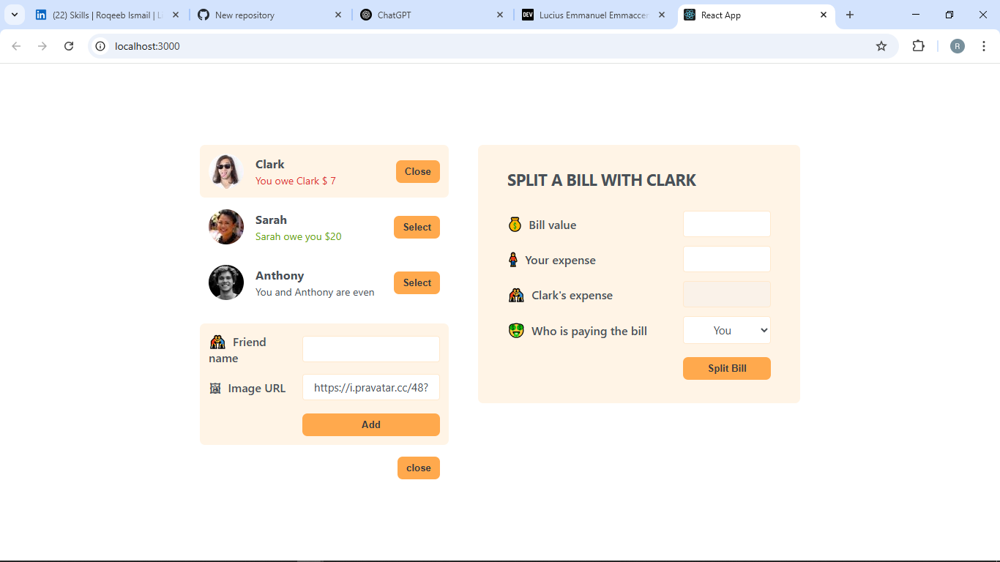
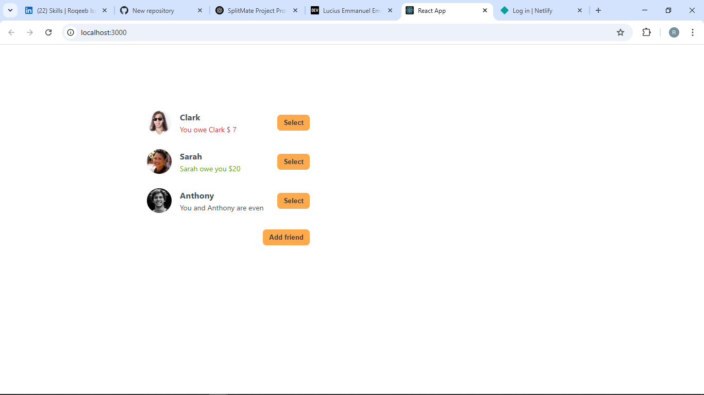

# 🍽️ Eat & Split – Fair Bills. Zero Awkwardness.



**Eat & Split** is a smart, simple web app that helps you split bills fairly with friends after eating out, partying, or hanging out.

## ✨ Why I Built This

I’m a self-taught frontend developer learning React — and this project was born from a common frustration I’ve experienced personally:

> "We went out... Who paid? Who owes what?"

So I built a solution: **Eat & Split**.

---

## 🔍 Features

- 👥 Add friends with names and avatars
- 💰 Enter a bill, split expenses by who paid
- ⚖️ Instantly calculate how much each person owes
- 🔁 Live feedback on balances (debt or even)
- 📱 Clean, responsive UI for mobile + desktop

---

## 🛠️ Built With

- **React.js** – Functional components and hooks
- **Tailwind CSS** – Utility-first modern styling
- **useState** – For dynamic state updates

---

## 🎓 What I Learned

- Managing local state in React
- Creating reusable components
- User experience (UX) best practices
- Handling calculations with real-world logic
- Improving layout and styling with Tailwind CSS

---

## 📸 Screenshots

| Friends List             | Split Bill Panel              |
| ------------------------ | ----------------------------- |
|  |  |

---

## 🚀 Live Demo

> 🔗 [https://your-netlify-link.netlify.app](https://your-netlify-link.netlify.app)

## 📂 Run Locally

```bash
git clone https://github.com/roqeebismail/eat-n-split.git
cd eat-n-split
npm install
npm run dev
```
